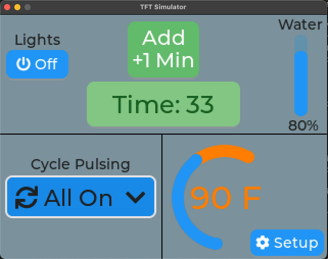

# LVGLPlusPlus Threading Example

There are a pair of sample programs to demonstrate [LVGLPlusPlus](https://github.com/bobwolff68/LVGLPlusPlus) C++ library:
- A threaded version [LVGLPlusPlus-ThreadedSample](https://github.com/bobwolff68/LVGLPlusPlus-ThreadedSample)
- A non-threaded version [LVGLPlusPlus-NonThreadedSample](https://github.com/bobwolff68/LVGLPlusPlus-NonThreadedSample)

The pair of examples (with and without threading) are intended to both educate on how to use some of the LVGLPlusPlus constructs as well as to be used as "starting templates" for those who wish to have a known good setup that functions in these configurations.

The examples currently are functional on Mac in so-called 'native' or 'simulation' compilation and utilize SDL2 and lv_drivers to do the screen/graphics platform support. The examples are also functional on an ESP32 DevKit circa 2021 attached to a 2.4" TFT touchscreen display based on the ILI9341 and this utilizes the Bodmer library "TFT_eSPI" (which is excellent). The IO pins for the TFT controls must be gleaned from the platform.ini file.

## Differences between samples

There are two different distinguishing characteristics between the samples. They both, however, produce the same end result of an automatically updating display which is also interactive.

### Threaded vs Non-Threaded Samples

As the two samples are named Threaded and Non-Threaded, this is the primary difference, structurally. LVGL is not a thread-safe library at the moment and so I wanted to show how threading can be used while staying safe in this regard. Most of my projects do utilize threading for underlying sensors as well as the user interface when possible. So, there is an underlying threading class called RoboTask and its brother, LockingRoboTask. The locking version is the key or integrating with LVGL. This can be done in two ways.
- In the hal/main_ESP32.cpp file, we use the LVTaskHandler class (defined in the cpp file) which is derived from LockingRoboTask and which automatically makes periodic calls to lv_task_handler() from inside a mutex which is locked in common with all other LockingRoboTask threads. This solves the LVGL threading issue entirely and obviates the need for the user to make calls to lv_task_handler() at all. This threaded version, then, does nothing in the loop() function for the ESP32 Arduino framework.
- In the emulated version, I show a different way in hal/main_emulated.cpp where you will see the while(1){} loop contains calls to the static functions of LockingRoboTask called TakeMutex() and GiveMutex(). These calls are used around the lv_task_handler() call to protect LVGL from the threading issue entirely. 

> If it isn't clear, any and all other thread related activities do need to utilize LockingRoboTask for these solutions to function as the key here is the use of the common mutex amongst the threads in an automated way.

Lastly, since TheBrain isn't threaded in the non-threaded version, the file GlobalObjects.cpp gained a function called widgets_update(). This function encompasses the items which were handled in TheBrain::Run(). The Run() is the actual thread portion of LockingRoboTask. Everything inside the Run() of LockingRoboTask is gated by TakeMutex() and GiveMutex(). In the non-threaded version, the widgets_update() function gets called in the emulated version hal/main_emulator.cpp from inside the while(1){} and gets called from the ESP32 Arduino framework version from inside loop() alongside lv_task_handler().

### LVGLPlusPlus library usage differences in samples

The other primary difference between the threaded and non-threaded samples are in how the LVGLPlusPlus widgets get instantiated and used. Note that the usage of the widgets is not related to threading - it's just a way to show two different ways in two different samples. This was done intentionally to give authors a sense of the two methods. If users wish to derive their own version of widgets like lvppButton and have all their placement, sizing, and callback (via onClicked()) buried inside their own class, they can see such usage in the non-threaded sample in Widgets.cpp and Widgets.h. If, instead, they would prefer to not hassle with having many new classes defined and would prefer to simply use the lvppButton "as is" by instantiating them directly and using lambda-style callback functions and the lvppScreen concept for changing values, they should gravitate to the Threaded version for seeing how this operates inside Widgets.cpp.

> NOTE: The difference in how the widgets get used in these two different methodologies has _nothing_ to do with threading or non-threading. I simply chose to use one project to show derived class usage and one project to show the other way of handling widget creation. 

## Summary of Sample Differences

I have tried to keep the changes between threaded and non-threaded to a bare minimum. The primary, structural difference, is that in the non-threaded version there is no need to protect any calls into the LVGL library. The LVGL library is not threadsafe and you will get crashes and errors if you use it in a multi-threaded environment without the use of mutexes. Ask me how I know. <cough-cough>

- Primary: hal/main_esp32.cpp and hal/main_emulated.cpp each no longer contain a LVTaskHandler instance for the mutex protection around the call to lv_task_handler(). This is handled in LVTaskHandler::Run() in the threaded version or via LockingRoboTask::TakeMutex() and GiveMutex in the emulated version just to show two ways of doing it.
- Primary: For non-threaded, the 'loop' now must call widgets_update() to facilitate the UI updates - this happens alongside lv_task_handler()
- Secondary: Removed "TheBrain.*" entirely and scooted the UI update mechanism into GlobalObjects.cpp
- Secondary: Added a Timer class for handling the slow UI update which was handled by TheBrain in the threaded case.
- Tertiary: Widgets.cpp has a button handler OnClicked() which was calling TheBrain to add time to the timer. In this new case, it simply calls a function in GlobalObjects.cpp to facilitate the same.

Ultimately I think the non-threaded sample is simpler to understand, but the threaded version (I feel) is more real-world in that UI and device based objects become threaded such that everyone runs in parallel (or at least many do) which makes for a more easily expandable and smooth running system in the long haul.

## Notable Resources at the top level
- The library upon which these samples site is [LVGLPlusPlus](https://bobwolff68.github.io/LVGLPlusPlus)
- The full Doxygen-generated docs for the LVGLPlusPlus library can be found on my Github Pages at [LVGLPlusPlus Doxygen Docs](https://bobwolff68.github.io/LVGLPlusPlus)
- If you're unfamiliar with LVGL, please go check out the [Main LVGL Site](https://lvgl.io)
  - The interactive forum for LVGL is also an excellent resource. Go check it out at [LVGL Forum](https://forum.lvgl.io/)
  - The main github repo for LVGL itself is at [LVGL Main](https://github.com/lvgl/lvgl).
  - The PlatformIO example on LVGL is at [LVGL with PlatformIO](https://github.com/lvgl/lv_platformio)
- The build environment I use is Microsoft VSCode with the PlatformIO extension. This library is a PlatformIO library. The author of LVGL gives some setup advice in the README for [LVGL with PlatformIO](https://github.com/lvgl/lv_platformio)
- I'll be turning on the Github _Issues_ and _Discussions_ features as soon as I can after going live with the public repo.
- Feel free to email me - b o b dot w o l f f 6 8 at g m a i l dot com - happy to entertain questions.

## To Do Items

- Once the main library is public, it will be added to the platformio registry. At that point, the platformio.ini file needs to be updated to no longer point directly at the github URL but instead properly reference the pio registry lib_deps library. This will make auto-upgrading seamless.
  - Currently, if the main library is updated and you've already built the sample project, there is no way for the sample project to know of the update and the (clunky) method to forcing this to be pulled again is by running a helper script called `./cleanLib.sh` which simply removes the underlying library from the .pio/libdeps/* folders. PlatformIO's library registry actually uses the library.json manifest to know when updates are made and compares these as part of the build process pre-build.
- Document the SDL bit on the Mac (homebrew and associated platform.ini items)
- Document use of lv_drivers in LVGLPlusPlus and how/why it is present in esp32 build

## Looking for digital engineering design services?

- As of Spring 2023 I'm open to contract work and happy to discuss projects. Get in touch - b o b dot w o l f f 6 8 at g m a i l dot c o m
